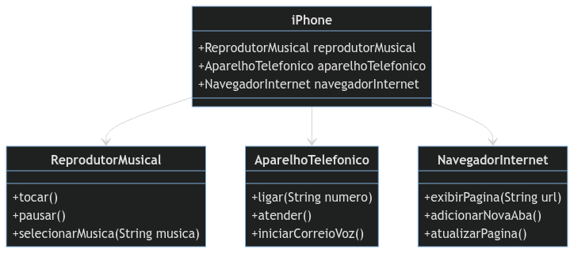

# Projeto iPhone UML e Implementação em Java 📱

## Descrição

Este desafio tem como objetivo modelar e diagramar a representação UML do componente iPhone, abrangendo suas funcionalidades como Reprodutor Musical, Aparelho Telefônico e Navegador na Internet. 
Para melhor entendimento das funcionalidades dos pilhares de POO foi utilizado classes e interfaces no projeto.

## Contexto do desafio
Com base no vídeo de lançamento do iPhone de 2007, o aluno deve elaborar a diagramação das classes e interfaces utilizando uma ferramenta UML de sua preferência. Em seguida, implementar as classes e interfaces no formato de arquivos .java.

[Lançamento iPhone 2007](https://www.youtube.com/watch?v=9ou608QQRq8) 


## Diagrama UML



<p align= "center"> Foi utilizado a plataforma Mermaid para desenvolver o diagrama de classes acima.</p>


# Interfaces

As interfaces serviram para dizer que o iphone teria acesso a todas elas e que o aparelho consegue implementar todas as funcionalidades de um reprodutor musical, um aparelho telefônico e um navegador de internet.

 Reprodutor Musical:
- `tocar()`
- `pausar()`
- `selecionarMusica(String musica)`
  
```java
public interface ReprodutorMusical {
    void tocar();
    void pausar();
    void selecionarMusica(String musica);
}
```

Aparelho Telefônico:
- `ligar(String numero)`
- `atender()`
- `iniciarCorreioVoz()`
  
```java
public interface AparelhoTelefonico {
    void ligar(String numero);
    void atender();
    void iniciarCorreioVoz();
}
```

Navegador na Internet:
- `exibirPagina(String url)`
- `adicionarNovaAba()`
- `atualizarPagina()`

```java
  public interface NavegadorInternet {
    void exibirPagina(String url);
    void adicionarNovaAba();
    void atualizarPagina();
}
```
#

Você pode adicionar o diagrama UML na seção indicada no README. Se precisar de mais alguma coisa, estou à disposição!
